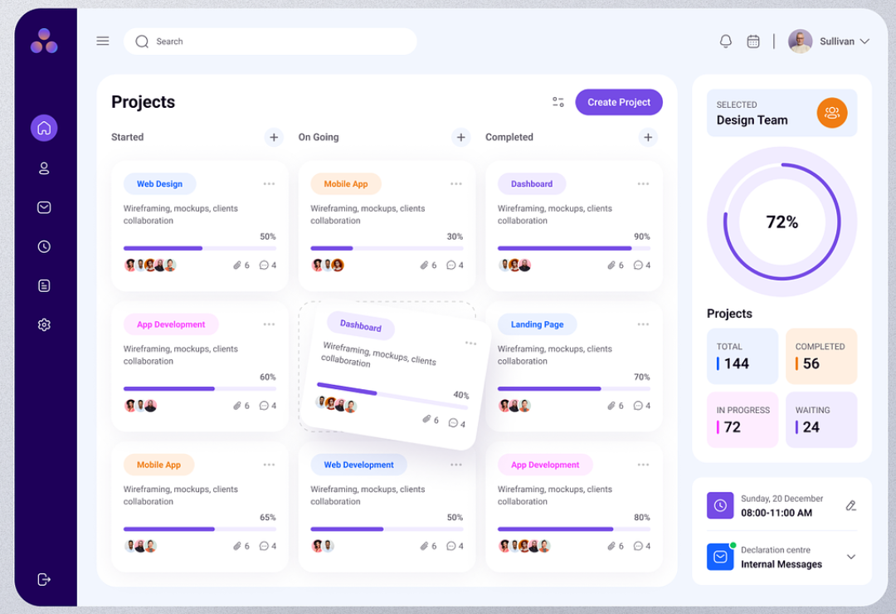

# TaskFlow

### Introduction

To build a task management dashboard in **Next.js** named TaskFlow that includes two screens: a task list and a Kanban board. The app enables users to manage tasks through a list view and a Kanban board, where tasks can be moved between statuses (To-Do, In-Progress and Complete) using **Drag and Drop** functionality. It includes user authentication, a backend built on Node.js, and a MongoDB database. The UI is visually appealing and implemented using **Shadcn UI** and **Accertinity UI**.

### Project Showcase

https://github.com/user-attachments/assets/ac3a9585-3ed4-4e31-a00e-d14a0970e4c0

### Tech Stack

- **Frontend:**

  - Next.js
  - React.js
  - TypeScript
  - State Management using Redux
  - Input Validation using Zod
  - Shadcn UI
  - Accertinity UI
  - Tailwind CSS

- **Backend:**

  - Node.js
  - Express
  - MongoDB
  - Input Validation using Zod

- **Deployment:**

  - Vercel

- **Version Control**
  - Git
  - Github

### Features and Requirements

1. **User Authentication:**

   - Implement user authentication (sign up, log in, and logout) using **JWT** (JSON Web Tokens) and **Next-Auth**.
   - Protect routes to ensure that only authenticated users can access the task management features.

2. **Task Management:**
   

   - Users can create, edit, delete, and view tasks.
   - Each task has the following fields:
     - Title (string, required)
     - Description (string, optional)
     - Status (enum: "To Do", "In Progress", "Completed")
     - Priority (enum: "Low", "Medium", "High")
     - Due Date (date, optional)
   - Tasks should be filterable and sortable by status, priority, and due date.

3. **Two Screens:**

   - **Task List Screen:**
     - Display a list of tasks with filtering and sorting options.
     - Allow users to perform **CRUD** operations directly from the list view.

   

   - **Kanban Board Screen:**
     - Implement drag-and-drop feature for easily handling the tasks.
     - Display tasks in a Kanban board format with columns for each status.
     - Enable **drag-and-drop** functionality for moving tasks between statuses.
     - Update the task status dynamically when moved between columns.

4. **Backend API:**

   - Build a backend API using **Node.js** and Express to handle CRUD operations for tasks and user authentication.
   - Connect to a **MongoDB** database to store user and task data.

5. **Frontend Features:**

   - Use **Next.js** to create a responsive and dynamic user interface.
   - Implement a task list view and a Kanban board view.
   - Use state management **Redux** to manage the application state.
   - Provide a form for creating and editing tasks.
   - Display error messages and handle form validation using **Zod**.

6. **UI Design:**

   - Use Shadcn to create a modern and visually appealing user interface.
   - Ensure the UI is responsive and user-friendly on both desktop and mobile devices.
   - Enhance interactivity with modals, tooltips, drag-and-drop areas, dropdowns, and notifications.

7. **Deployment:**

   - Deploy the app on Vercel and ensure that it is fully functional.
     
   - Test credentials:
     - Username: zorojoro@gmail.com
     - Password: 12345678
   - Please check out my website and share your feedback!

8. **Code Quality:**

   - Followed best practices for React and MERN stack development.
   - Write clean, maintainable, and modular code.
   - Included comments to explain complex logic.
   - Used **TypeScript** to define types for better maintainability.

9. **Additional Considerations:**
   - Used a Git version control system.
   <!-- - Implement at least one custom hook in React to manage some part of the application logic. -->

---
